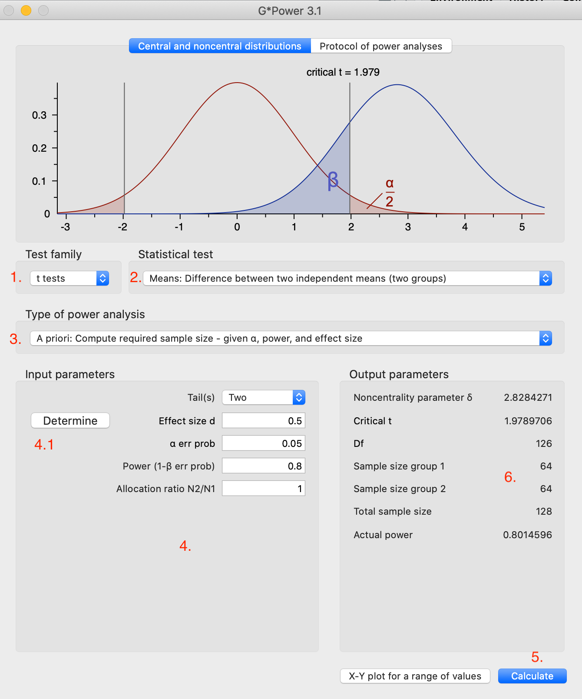
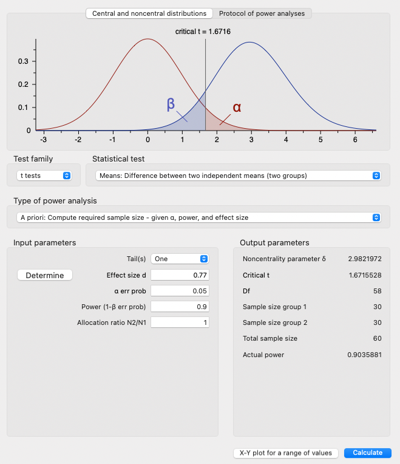
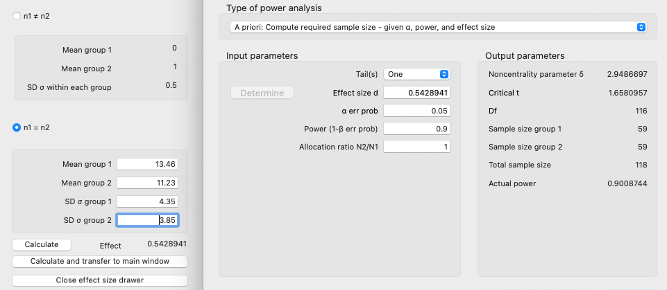

# เกริ่นนำ

ในการทดสอบสมมติฐานว่าง (null hypothesis significant testing) อิทธิพลที่ผู้วิจัยกำลังศึกษาอาจมีอยู่จริง ($H_0$ เป็นเท็จ) แต่ผลการวิเคราะห์ทางสถิติกลับไม่ถึงระดับนัยสำคัญ จึงไม่สามารถปฏิเสธสมมติฐานว่างได้ (fail to reject \$H_0\$) กรณีที่การวิเคราะห์ทางสถิติมีกำลังไม่พอที่จะปฏิเสธสมมติฐานว่างนี้ เรียกว่า Type II error เราใช้ $\beta$ เป็นสัญลักษณ์แทนความน่าจะเป็นที่ว่า หากสมมติฐานว่างไม่เป็นจริง มีความน่าจะเป็นเท่าใดที่เราจะสังเกตได้ค่าสถิติที่ไม่ถึงระดับนัยสำคัญทางสถิติ การเกิด Type II error ทำให้ผู้วิจัยสรุปว่าไม่พบความแตกต่างทั้งที่ความแตกต่างมีอยู่จริง หรือ ที่เรียกว่า ผลลบลวง (false negative)

การลด Type II error ($\beta$) ก็คือการเพิ่มกำลังทางสถิติ (power; $1-\beta$) ในขณะที่ค่า Type I error ($\alpha$) มีธรรมเนียมกำหนดไว้ที่ .05 *ค่ากำลังทางสถิติมักถูกกำหนดอยู่ระหว่าง .80 - .90 ขึ้นอยู่กับผู้วิจัย*

เพื่อให้ได้กำลังทางสถิติที่เพียงพอต่อการทดสอบสมมติฐาน นักวิจัยสามารถดำเนินการได้หลายอย่าง เช่น พยายามควบคุมปัจจัยแทรกซ้อนเพื่อให้ได้ผลที่คงที่มากขึ้น พยายามให้กระบวนการจัดกระทำที่ทำให้เกิดผลชัดเจนหรือเกิดความแตกต่างมาก ๆ หรือพยายามเพิ่มกลุ่มตัวอย่างให้มากขึ้นเพื่อลดความคลาดเคลื่อนจากการสุ่มตัวอย่าง เป็นต้น

การวิเคราะห์กำลังทางสถิติ(power analysis) ขึ้นอยู่กับพารามิเตอร์ 4 ตัวได้แก่

1.  ขนาดกลุ่มตัวอย่าง
2.  ขนาดอิทธิพล
3.  ระดับค่า $\alpha$
4.  ระดับค่ากำลัง

โดยปกติผู้วิจัยจะกำหนดค่า alpha และค่า power ที่ต้องการไว้ เช่น $\alpha = .05$ และ power = .80 เป็นต้น ดังนั้นผู้วิจัยจึงเหลือต้องควบคุมพารามิเตอร์อีกสองตัวที่เหลือเพื่อให้ได้ค่า power ที่ต้องการ

ในการออกแบบการทดลอง ผู้วิจัยมักจะอ้างอิงรูปแบบการทดลองจากงานวิจัยที่ผ่านมา ด้วยเหตุนี้ผู้วิจัยจึงพอจะทราบได้ว่าผลการทดลองที่ผ่าน ๆ มีขนาดอิทธิพลประมาณเท่าใด (บางครั้งก็อ้างอิงได้จากการวิเคราะห์อภิมาน meta-analysis) ดังนั้นจึงเหลือพารามิเตอร์ตัวสุดท้าย นั่นคือ เราต้องใช้กลุ่มตัวอย่างขนาดเท่าใดจึงจะได้ขนาดกำลังที่ต้องการ

ด้วยเหตุนี้ การวางแผนออกแบบการวิจัยเพื่อทดสอบสมมติฐาน ผู้วิจัยจึงควรต้องศึกษาขนาดอิทธิพลของงานวิจัยในอดีตเพื่อใช้วิเคราะห์กำลังทางสถิติ แล้วกำหนดว่างานวิจัยของตนนั้นจำเป็นต้องใช้กลุ่มตัวอย่างขนาดเท่าใด (งานวิจัยที่มีกำลังไม่พอ มีความเป็นไปได้สูงที่จะทำแล้วเสียเปล่า เพราะแม้ว่าจะมีอิทธิพลอยู่จริง ก็มีโอกาสสูงที่จะไม่พบความแตกต่างที่มีนัยสำคัญ)

ในแบบฝึกหัดนี้เราจะได้เรียนรู้การวิเคราะห์กำลังทางสถิติเพื่อกำหนดจำนวนกลุ่มตัวอย่างโดยใช้ G\*Power และ `pwr` package ใน R

# 1. G\*Power

G\*Power เป็นโปรแกรมที่พัฒนาโดยกลุ่มนักวิจัยจาก Heinrich-Heine-Universität Düsseldorf โปรแกรมนี้มี GUI (graphic user interface) ที่ใช้งานง่ายเน้นการคลิก ไม่ต้องเขียนโค้ด และครอบคลุมการวิเคราะห์กำลังสำหรับสถิติที่เป็นที่นิยมค่อนข้างครบถ้วน [ดาวน์โหลดโปรแกรมที่นี่](https://www.psychologie.hhu.de/arbeitsgruppen/allgemeine-psychologie-und-arbeitspsychologie/gpower)



องค์ประกอบในหน้าต่าง

1.  เมนู Test family ใช้สำหรับเลือกกลุ่มของสถิติทดสอบ เช่น *t* tests, *F* tests, $\chi^2$ test เป็นต้น
2.  เมนูสถิติทดสอบ Statistical test ใช้เลือกสถิติที่เฉพาะเจาะจงกับการวิเคราะห์ที่ผู้วิจัยต้องการ เช่น independent *t*-test, one sample *t*-test, paired *t*-test, หรือ การทดสอบสัมประสิทธิ์ถดถอยแต่ละตัว เป็นต้น
3.  เมนูเลือกชนิดการวิเคราะห์กำลัง (Type of power analysis) โดยปกติแล้วเราจะเลือก "A priori: Compute required sample size" เพื่อคำนวณจำนวนกลุ่มตัวอย่าง
4.  Input parameters
    i)  Tail(s): เลือกว่าการทดสอบเป็นแบบหางเดียว หรือสองหาง
    ii) Effect size: ค่านี้จะแตกต่างกันไปตามสถิติที่ต้องการ ในตัวอย่างด้านบนเป็นการทดสอบความแตกต่างของค่าเฉลี่ยด้วย *t*-test ขนาดอิทธิพลที่โปรแกรมนี้ใช้คือ ค่า Cohen'*d* (หากนำเมาส์ไปวางบนกล่อง จะปรากฏขนาดอิทธิพลตามธรรมเนียมปฏิบัติไว้ใช้อ้างอิง) **4.1** ปุ่ม Determine หากเราไม่ทราบค่า effect size โปรแกรมสามารถช่วยคำนวณให้จากข้อมูลอื่น ๆ เช่น *M*, *SD*, *n* ของแต่ละกลุ่ม ซึ่งมักหาได้ไม่ยากจากบทความ (เช่น ตาราง descriptive statistics)
    iii) $\alpha$ err prob: กำหนดค่า alpha โดยปกติจะเป็น .05
    iv) Power: กำหนดค่า power ที่ต้องการใช้ในการวิจัยของเรา โดยมากมักจะอยู่ระหว่าง .80 - .90
    v)  Allocation ration N2/N1: เมนูหลังจากนี้จะเปลี่ยนไปตามสถิติที่ใช้ ในตัวอย่างนี้ คือ การระบุสัดส่วนของกลุ่มตัวอย่างในสองเงื่อนไข หากสองเงื่อนไขมีกลุ่มตัวอย่างเท่ากัน ให้ค่านี้เป็น 1
5.  ปุ่ม Calculate
6.  จำนวนกลุ่มตัวอย่างที่ต้องใช้และพารามิเตอร์อื่น ๆ จะปรากฏที่กล่องนี้

## 1.1 Independent *t*-test with known effect size

สมมติว่าผู้วิจัยต้องการศึกษาปรากฏการณ์ ego-depletion โดยใช้งานขีดฆ่าตัวอักษร (crossing out letters task) ซึ่งมีการวิเคราะห์อภิมานว่ามีขนาดอิทธิพลเท่ากับ .77 (Hagger et al., 2010) ผู้วิจัยจำเป็นต้องใช้กลุ่มตัวอย่างเท่าใดเพื่อที่จะพบผลที่มีนัยสำคัญทางสถิติ หากปรากฏการณ์นี้มีอยู่จริง

1.  เลือก t-test ในช่อง Test family
2.  สมมติให้ออกแบบการทดลองแบบระหว่าง 2 กลุ่ม (ทดลอง-ควบคุม) ให้เลือก "Means: Difference between two independent means (two groups)" ซึ่งเป็นคำอธิบายของการทดสอบ independent *t*-test
3.  เลือก Type of power analysis เป็น "A priori: Compute required sample size - given $\alpha$, power, and effect size"
4.  ใน input parameters
    i.  Tail(s): เลือกเป็น One เนื่องจากเรามีทิศทางที่ตั้งสมมติฐานชัดเจน (หากไม่แน่ใจให้เลือก Two)

    ii. Effect size d = .77 ตามค่าที่ค้นคว้าได้จากงานวิจัย

    iii. $\alpha$ err prob = .05 ตามธรรมเนียม

    iv. Power (1 - $\beta$ err prob) = .90

    v.  Allocation ration N2/N1 = 1 ออกแบบเป็น balanced design กลุ่มตัวอย่างในสองเงื่อนไขเท่ากัน



เพื่อให้ได้ power = .90 โดยเชื่อว่า effect size *d* = .77 จะต้องใช้กลุ่มตัวอย่างเงื่อนไขละ 30 คน ค่าวิกฤติของสถิติทดสอบ t คือ 1.672

# 1.2 Independent t-test with known *M* and *SD*

หากงานวิจัยที่เราใช้อ้างอิงไม่ได้รายงานค่า effect size *d* เราสามารถคำนวณขนาดอิทธิพลได้จากค่าเฉลี่ยและส่วนเบี่ยงเบนมาตรฐานของแต่ละกลุ่ม สมมติว่าในการทดสอบจำนวนคำที่ผู้เข้าร่วมการทดลองจำได้ เปรียบเทียบระหว่างเงื่อนไขทดลอง (*M* = 13.46 คำ, *SD* = 4.35) และเงื่อนไขควบคุม (*M* = 11.23 คำ, *SD* = 3.85) ให้

1.  กดปุ่ม Determine ข้างหน้าช่อง Effect size d
2.  กรอกค่า M และ SD
3.  กดปุ่ม Calculate เพื่อดูขนาด effect size หรือ กด Calculate and transfer to main window เพื่อนำข้อมูลไปกรอกในช่อง Effect size d
4.  กด Calculate ในหน้าต่างหลักเพื่อคำนวณ Sample size



# 2. `pwr` package

```{r}
#install.packages("pwr")
library(pwr)
```

อ่านคำแนะนำ package [ได้ที่นี่](https://cran.r-project.org/web/packages/pwr/vignettes/pwr-vignette.html).

`pwr` package มีคำสั่งวิเคราะห์กำลังสำหรับสถิติทดสอบหลัก ๆ ได้แก่

-   `pwr.p.test`: one-sample proportion test
-   `pwr.2p.test`: two-sample proportion test
-   `pwr.2p2n.test`: two-sample proportion test (unequal sample sizes)
-   `pwr.t.test`: two-sample, one-sample and paired t-tests
-   `pwr.t2n.test`: two-sample t-tests (unequal sample sizes)
-   `pwr.anova.test`: one-way balanced ANOVA
-   `pwr.r.test`: correlation test
-   `pwr.chisq.test`: chi-squared test (goodness of fit and association)
-   `pwr.f2.test`: test for the general linear model

สำหรับการออกแบบที่ซับซ้อน เช่น factorial design หรือ repeated-measure design เราจะต้องใช้ package อื่น

## 2.1 Known effect size

เราจะใช้คำสั่ง `pwr.t.test` สำหรับตัวอย่าง independent *t*-test เรื่อง ego-depletion ด้านบน

คำสั่งนี้เรามี argument ตามด้านล่าง

    pwr.t.test(n = NULL, 
    d = NULL, 
    sig.level = 0.05, 
    power = NULL, 
    type = c("two.sample", "one.sample", "paired"),
    alternative = c("two.sided", "less", "greater"))

เนื่องจากเราต้องการกำหนดจำนวนกลุ่มตัวอย่าง `n` เราจะไม่ใส่ argument นี้ในคำสั่ง

กำหนดเฉพาะ `d`, `power`, `type`, และ `alternative` ตามตัวอย่างด้านล่าง

```{r}
pwr.t.test(d=.77, sig.level=.05, power = .9, type = "two.sample", alternative = "greater")
```

เราจะได้ค่า *n* ออกมา (สำหรับ**แต่ละ**เงื่อนไข) จากนั้นปัดเศษ จะได้เท่ากับที่คำนวณด้วย G\*Power

## 2.2 Known *M* and *SD*

เริ่มต้นด้วยการคำนวณ effect size Cohen's *d* ด้วยสูตรด้านล่าง (กรณีกลุ่มตัวอย่างเท่ากัน)

$$
d = \frac{\bar{X}_1 - \bar{X}_2}{s_{p}} = \frac{\bar{X}_1 - \bar{X}_2}{\sqrt{\frac{s_1^2+s_2^2}{2}}}
$$

```{r}
d <- (13.46 - 11.23)/sqrt((4.35^2 + 3.85^2)/2)
d
pwr.t.test(d=d, sig.level=.05, power = .9, type = "two.sample", alternative = "greater")
```

## 2.3 Plotting a power graph

เราสามาถใช้คำสั่ง `plot()` เพื่อแสดงภาพความสัมพันธ์ระหว่างจำนวนกลุ่มตัวอย่างกับขนาดกำลัง ภายใต้เงื่อนไขพารามิเตอร์ที่กำหนด

```{r}
medium_power <- pwr.t.test(d=.5, sig.level=.05, power = .8, type = "two.sample", alternative = "two.sided")
plot(medium_power)
```

# 4. Other power functions

## One-way ANOVA

คำสั่ง `pwr.anova.test` ใช้คำนวณกลุ่มตัวอย่างสำหรับ one-way ANOVA ได้ โดยเราจะต้องกำหนดจำนวนกลุ่มในการเปรียบเทียบ `k`, effect size แบบ Cohen's `f` , และระดับ `power` ที่ต้องการ

```{r}
library(pwr)
pwr.anova.test(k = 3, f = .25, power = .8) # An example of medium effect size with three conditions. 
```
