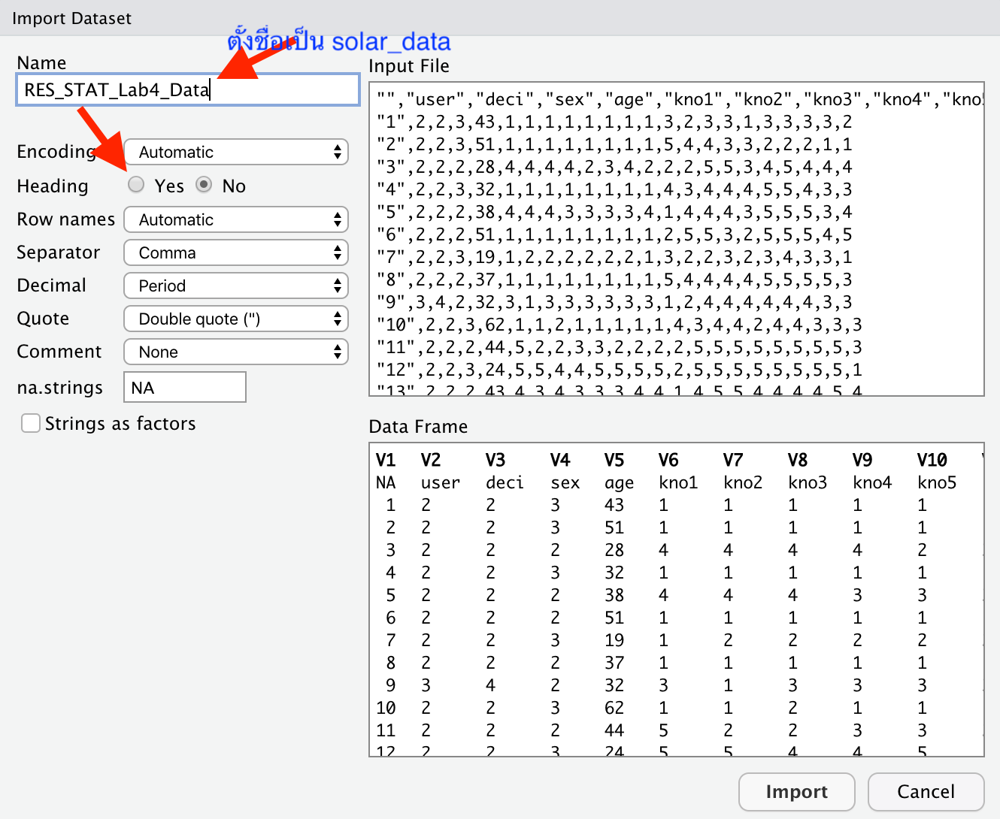

# 1. การคำนวณความแปรปรวน (variance)

การคำนวณค่าความแปรปรวนใน R นั้นทำได้ง่าย ๆ ด้วยคำสั่ง `var()`
อย่างไรก็ดีวัตถุประสงค์ของแบบฝึกหัดนี้ คือ
แสดงให้เห็นถึงขั้นตอนในการคำนวณค่าความแปรปรวนไปทีละขั้นด้วยคำสั่ง R

สมมติว่า เราเปิดร้านอาหารและเก็บข้อมูลการสั่งโอเลี้ยงของลูกค้าแต่ละโต๊ะ

| โต๊ะ \| | จำนว นแก้ว |
|--------|-----------|
| A      | 2         |
| B      | 4         |
| C      | 3         |
| D      | 1         |
| E      | 1         |
| F      | 2         |
| G      | 1         |

เราจะเริ่มต้นด้วยการสร้างตัวแปร (variable) ชื่อ `drinks`
เพื่อบันทึกข้อมูลจำนวนแก้วโอเลี้ยงจากแต่ละโต๊ะ

```{r}
drinks <- c(2, 4, 3, 1, 1, 2, 1)
drinks
```

เราต้องการคำนวณค่าการกระจายตัวของการสั่งโอเลี้ยง โดยใช้ค่าความแปรปรวน (variance)
ซึ่งมีสูตรคำนวณคือ $$s^2 = \frac{\sum{(X - \bar{X})^2}}{N -1}$$

ในสมการนี้เรารู้ว่า\
ค่า $X$ คือ ค่าของข้อมูลแต่ละตัว\
ค่า $N$ คือ ค่าจำนวนกลุ่มตัวอย่าง

เราใช้คำสั่ง `length()` เพื่อหาจำนวนตัวอย่างในตัวแปร

```{r}
n <- length(drinks)
n
```

จึงเหลือค่า $\bar{X}$ ที่ต้องคำนวณด้วยคำสั่ง `mean()`

```{r}
mean_drinks <- mean(drinks)
mean_drinks
```

การคำนวณการกระจายตัว คือ การหาว่าข้อมูลแต่ละตัวเบี่ยงเบนในจากค่ากลาง (ค่าเฉลี่ย)
มากน้อยเพียงใด (deviation scores) เราจะนำค่าข้อมูลแต่ละตัวใน `drink`
ไปลบด้วยค่าเฉลี่ยที่คำนวณได้ จากนั้นบันทึกลงในตัวแปรชื่อ `deviation_drinks`

```{r}
deviation_drinks <- drinks - mean_drinks 
deviation_drinks
```

ค่าความเบี่ยงเบนแบบนี้จะประกอบไปด้วยค่าที่สูงกว่าค่าเฉลี่ย (ติดบวก) หรือค่าที่ต่ำกว่าค่าเฉลี่ย
(ติดลบ) และเมื่อรวมกันได้จะได้ 0 ซึ่งไม่สามารถนำไปใช้คำนวณอะไรต่อได้

```{r}
sum(deviation_drinks)
```

เพื่อให้ได้ *ขนาด* (magnitude) ของความเบี่ยงเบนที่ไม่ติดลบ
จึงนำค่าเบี่ยงเบนนี้ไปยกกำลังสอง

```{r}
sqr_dev <- deviation_drinks ^ 2
sqr_dev
```

จากนั้นถึงหาผลรวม (sum) ตามสูตร $\sum{(X - \bar{X})^2}$\
ค่าผลรวมนี้เรียกว่า sum of squares (*SS*) หรือที่เรียกเต็ม ๆ ว่า sum of squared
deviations

```{r}
sum(sqr_dev)
```

จากนั้นนำไปหารด้วย degrees of freedom ($N - 1$) ซึ่งก็คือการคำนวณว่า
โดยเฉลี่ยแล้วข้อมูลเบี่ยงเบนมากน้อยเพียงใด (mean of squares; *MS*)
หรือที่เรียกว่าค่าความแปรปรวน\

```{r}
sum(sqr_dev)/(n-1)
```

เนื่องจากเป็นค่าที่มีการคำนวณบ่อย R จึงมีคำสั่งเฉพาะสำหรับความแปรปรวน คือ `var()`
(สามารถทดสอบได้ว่าทั้งสองค่าเท่ากันด้วย `==`)

```{r}
var(drinks)
sum(sqr_dev)/(n-1) == var(drinks) #same value
```

ค่าส่วนเบี่ยงเบนมาตรฐาน (*SD*) ก็คือรากที่สองของ variance

คำสั่งรากที่สอง คือ `sqrt()`

```{r}
sqrt(var(drinks))
```

R มีคำสั่งเฉพาะสำหรับส่วนเบี่ยงเบนมาตรฐาน คือ `sd()`

```{r}
sd(drinks)
```

## เทคนิคการเขียนโค้ด

เมื่อเราเริ่มชำนาญในการเรียกใช้คำสั่งต่าง ๆ แล้ว เราสามารถประหยัดบรรทัดการเขียนโค้ด
ด้วยการซ้อนคำสั่งต่าง ๆ เข้าด้วย เช่น `sum((drinks-mean(drinks))^2)` จะได้ค่า sum
of squares

หากต้องการซ้อนคำสั่งเพื่อคำนวณความแปรปรวนสามารถทำได้ดังนี้

```{r}
sum((drinks-mean(drinks))^2)/(length(drinks)-1)
```

# 2. ค่าสถิติเชิงพรรณาจากข้อมูลตัวอย่าง

## 2.1 นำเข้าข้อมูลและตั้งค่า working directory

### การนำเข้าด้วยโค้ด

เพื่อให้โค้ดทำงานง่ายที่สุด แนะนำให้[ดาวน์โหลดไฟล์ข้อมูล
(csv)](RES_STAT_Lab4_Data.csv) นี้ลงใน working directory (สามารถดู working
directory ได้ด้วย `getwd()` )

หากไฟล์ R script ที่กำลังเปิดใช้งานอยู่ใน directory อื่น เราสามารถเปลี่ยน working
directory ไปยัง folder ของไฟล์นั้นได้ โดยเลือกเมนู Session -\> Set working
directory -\> To source file location (หรือใช้คำสั่ง R ด้านล่าง) และให้ save
ไฟล์ข้อมูลไว้ใน folder เดียวกับ R script นั้น

```{r eval=FALSE, include=TRUE}
getwd() #see current working directory
setwd(dirname(rstudioapi::getSourceEditorContext()$path)) #Use this code to set working directory to the source file location
```

เมื่อ set working directory เป็น folder ที่มีข้อมูลอยู่ เราจะสามารถโหลดข้อมูลเข้า R
ได้โดยเรียกชื่อไฟล์นั้นโดยตรง ด้วยคำสั่ง `read.csv("path")` โดยให้บันทึกเป็น data
frame ชื่อ solar_data

```{r}
solar_data <- read.csv("RES_STAT_Lab4_Data.csv")
head(solar_data) #look at top 5 rows
```

### การนำเข้าด้วยปุ่ม Import Dataset

เราสามารถนำเข้าข้อมูลโดยกดปุ่ม Import Dataset ที่อยู่ในหน้าต่าง Environment
(ปกติอยู่ที่ช่องขวาบนของ RStudio) เลือก *From Text (base)*

ตั้งชื่อ variable เป็น `solar_data`

แล้วเลือกตัวเลือก Heading เป็น *Yes* สำหรับข้อมูลที่มีหัวตาราง



### คำอธิบายข้อมูล

`user` กลุ่มผู้ใช้ไฟฟ้า (nominal 5 กลุ่ม)

`deci` เป็นผู้มีอำนาจตัดสินใจว่าจะติดตั้งโซลาร์เซลล์หรือไม่ (nominal 5 ระดับ)

`sex` เพศของผู้ตอบ (nominal 3 ระดับ)

`age` อายุของผู้ตอบ (ratio scale)

`kno1` ถึง `kno8` ความรู้เกี่ยวกับเทคโนโลยีโซลาร์เซลล์ (ordinal 5 ระดับ)

`inno` ระดับการเปิดรับนวัตกรรม (ordinal 5 ระดับ)

`att1` ถึง `att8` เจตคติต่อการติดตั้งโซลาร์เซลล์เพื่อผลิตไฟฟ้าใช้เอง/ขาย (ordinal 5
ระดับ)

`interest` เจตนาที่จะติดตั้งโซลาร์เซลล์เพื่อผลิตไฟฟ้าใช้เอง/ขาย (ordinal 5 ระดับ)

## 2.2 Data Cleaning

ตัวแปร user เป็นประเภทผู้ใช้ไฟฟ้า โดยค่า 1 และ 2 เป็นประเภทผู้ใช้ไฟฟ้าภาคครัวเรือน ส่วน
3-5 เป็นผู้ใช้ไฟฟ้าภาคธุรกิจ

เราใช้คำสั่ง `table()` เพื่อดูตารางความถี่ของ user แต่ละประเภทได้

```{r}
table(solar_data$user)
```

ในตัวอย่างนี้เราจะใช้เฉพาะข้อมูลภาคครัวเรือน ดังนั้นเราจะเลือกเฉพาะข้อมูลของ user = 1
หรือ 2 ออกมาเท่านั้น

โดยปกติแล้วข้อมูลประเภทนี้เป็นข้อมูลเชิงคุณภาพ และมักถูกบันทึกเป็นตัวอักษร (character
strings) แต่ในกรณีนี้ ข้อมูลถูกเข้ารหัสเป็นตัวเลข (numeric)
ดังนั้นเราจะให้ประโยชน์จากตรงนี้ในการเขียนสูตรเลือกกลุ่ม user 1-2 และคัด 3-5 ทิ้ง

เราจะเลือก data frame `solar_data` เฉพาะ "แถว" ที่ user เป็น 1 หรือ 2
(นั่นคือน้อยกว่า 3) และเลือกทุก "คอลัมน์" จากนั้นบันทึกเป็นตัวแปรใหม่ชื่อ
`household_solar_data`

```{r}
household_solar_data <- solar_data[solar_data$user < 3, ]
table(household_solar_data$user)
```

### การเปลี่ยนประเภทข้อมูลจัดประเภท (categorical) เป็น factor

ใช้คำสั่ง `factor()` เพื่อแปลง user เป็นตัวแปรประเภท factor พร้อมกับใส่ label
ให้เรียบร้อย ลำดับของ labels จะต้องเรียงตามลำดับของรหัสตัวแปร เช่น 2 = regular
residence และ 1 = small residence

เนื่องจาก R จะติด labels โดยเรียงจากน้อยไปมาก เราจึงต้องใส่ลำดับในตัวเลือก labels
โดยเอา small residence ขึ้นก่อน แล้วตามด้วย regular residence เพื่อให้ตรงกับ ค่า 1
และ 2

```{r}
household_solar_data$user <- factor(household_solar_data$user, labels = c("small residence", "regular residence"))
table(household_solar_data$user) #always check your results
str(household_solar_data$user) # see structure of the variable
```

## 2.3 ข้อมูลจัดประเภท (Categorical Data)

### Frequency table

เปลี่ยนตัวแปร sex ให้เป็น factor (1 = Not answer; 2 = male; 3 = female)

```{r}
table(household_solar_data$sex) #before
household_solar_data$sex <- factor(household_solar_data$sex, labels = c("Not answer", "male", "female" ))

str(household_solar_data$sex)
```

การสร้างตารางความถี่ใช้คำสั่ง `table()` ซึ่งสามารถใช้ได้กับตัวแปร numeric หรือ factor
ก็ได้\
แต่ถ้าหากใช้คำสั่ง `summary()` กับตัวแปร factor ก็จะได้ผลเป็นตารางแจกแจงความถี่เช่นกัน

```{r}
table(household_solar_data$sex)
summary(household_solar_data$sex)

```

### Bar graph

แผนภูมิแท่งนิยมใช้เพื่อแสดงความถี่ของตัวแปร เราใช้คำสั่ง `plot()` เพื่อสร้างกราฟ
หากตัวแปรเป็น factor โปรแกรมจะเลือก bar graph ให้โดยอัตโนมัติ

```{r}
plot(household_solar_data$sex)
```

### Contingency table

หากเราต้องการดูความถี่ของตัวแปรจัดประเภทตัวหนึ่งแบ่งตามตัวแปรอีกตัว เช่น
ความถี่ของเพศแบ่งตามประเภทผู้ใช้ไฟฟ้า เราสามารถสร้างตารางไขว้แบบ contingency
table โดยใช้คำสั่ง `table(var1, var2)`

```{r}
table(household_solar_data$user, household_solar_data$sex)
```

## 2.4 ข้อมูลเชิงตัวเลข (numerical data)

### ค่าเฉลี่ย (mean; *M*)

ในการสรุปข้อมูลเชิงปริมาณ ค่ากลางของการกระจายตัวมักคำนวณโดยใช้ค่าเฉลี่ยเลขคณิต (mean)
เช่น ค่าเฉลี่ยของอายุ

```{r}
mean(household_solar_data$age)
```

ค่ากลางอีกตัวหนึ่งที่ได้รับผลกระทบจากคะแนนสุดโต่ง (outliers)
หรือความเบ้ของข้อมูลน้อยกว่าคือ ค่ามัธยฐาน (median)

```{r}
median(household_solar_data$age)
```

หากเราใช้คำสั่ง `summary()` กับตัวแปรเชิงตัวเลข เราจะได้ตารางสรุปค่าในจุดต่าง ๆ
ของข้อมูลออกมา

```{r}
summary(household_solar_data$age)
```

### ส่วนเบี่ยงเบนมาตรฐาน (standard deviation; *SD*) และความแปรปรวน (variance)

ส่วนเบี่ยงเบนมาตรฐานและความแปรปรวนคำนวณได้โดยคำสั่ง `sd()` และ `var()`

```{r test}
sd(household_solar_data$age)
var(household_solar_data$age)
```

### ตารางสถิติเชิงพรรณา (Descriptive Stats Table) ด้วย psych package

คำสั่งมาตรฐานใน R
ไม่มีคำสั่งเฉพาะในการสร้างตารางสถิติที่นิยมใช้กันในการรายงานผลการวิจัยทางจิตวิทยา
จึงมีผู้เขียน package สำหรับการนี้โดยเฉพาะ

เริ่มต้นด้วยการติดตั้ง (install) package (ทำเพียงแค่ครั้งเดียว) และเรียกใช้ (library)
package ใน session R (ต้องทำทุกครั้งที่เปิด R ขึ้นมาใหม่)

```{r eval=FALSE, include=TRUE}
install.packages("psych") # You need to only do this once. 
library(psych) # must do this everytime you restart R. 
```

```{r include=FALSE}
library(psych)
```

เมื่อติดตั้งและเรียกใช้แล้ว เราจะใช้ทำสั่ง `desribe` ของ psych package
เพื่อสร้างตารางสถิติ

เราลองใช้คำสั่งนี้กับคอลัมน์ที่ 4 และ 5 (sex และ age)

```{r}
psych::describe(household_solar_data[, 4:5])
```

สังเกตได้ว่า แม้ sex จะเป็นตัวแปรจัดประเภท คำสั่งก็พยายามจะคำนวณค่าให้
แต่มีเครื่องหมายดอกจัน (\*) เตือนไว้ให้รู้ว่า ค่าสถิติเหล่านี้อาจไม่สามารถแปลความหมายได้
เนื่องจากค่าตัวเลขในตัวแปรจัดประเภทไม่ได้มีความหมายทางคณิตศาสตร์

ชื่อเต็มของค่าต่าง ๆ ในตารางสามารถดูได้ในหัวข้อ Value ของตัวช่วย

```{r}
?describe
```

### Histogram และ Boxplot

Histrogram และ boxplot เป็นแผนภูมิที่เหมาะสำหรับแสดงการแจกแจงความถี่
(distribution) ของข้อมูลเชิงปริมาณ

```{r}
hist(household_solar_data$age)
```

```{r}
boxplot(household_solar_data$age)
```
